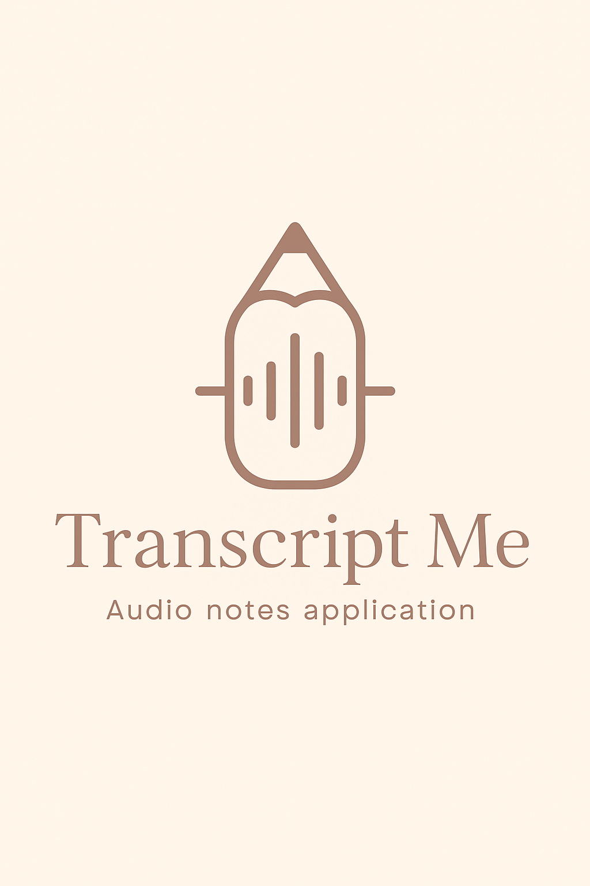

# 📝 Transcript Me

An interactive web application designed to transcribe audio files into text with added features for easy editing, searching, and exporting transcripts. The app supports improving accessibility and streamlining the documentation of spoken content.

---

## 📷 Logo

  

---

## 🛠 Technologies and tools

- Python 🐍  
- Streamlit  
- Speech recognition libraries (e.g., SpeechRecognition, Whisper)  
- Pandas  
- Text processing libraries  

---

## 🚀 Skills demonstrated in this project

- audio processing and speech-to-text transcription  
- text data cleaning and manipulation  
- building user-friendly interactive apps  
- implementing search and export functionalities  
- working with external APIs or local speech models  
